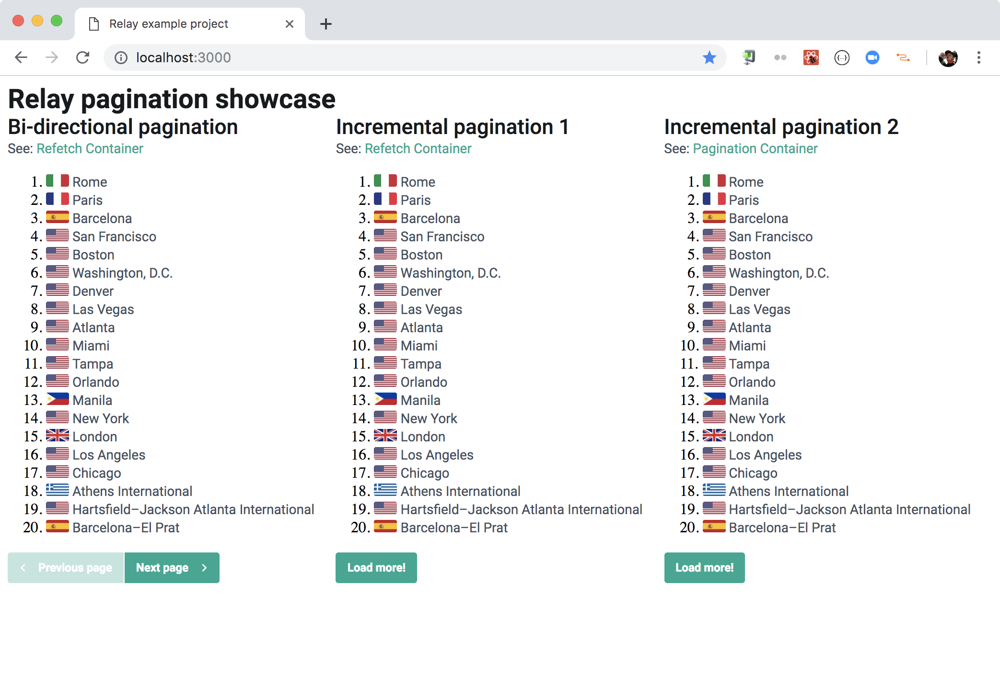

build-lists: true

# GraphQL gifts from Kiwi.com

### Michal Sänger

### `michal.sanger@kiwi.com`

^
Hello everyone...

---

# ESLint & Babel preset

- Consistent codebase
- Faster code reviews
- Modern JS features

---

# ESlint

`yarn add --dev @kiwicom/eslint-config`

- React, RN, Hooks, Relay
- Prettier, Jest
- Flow, Node
- extendable

---

# ESlint

```js
//.eslintrc.js
module.exports = {
  root: true,
  extends: [
    '@kiwicom/eslint-config',
  ],
};
```

---

# Do not ignore ESLint warnings!

```js
//.eslintrc.js
module.exports = {
  root: true,
  extends: [
    '@kiwicom/eslint-config/strict',
  ],
};
```
---

# Babel Preset

`yarn add --dev @kiwicom/babel-preset-kiwicom`

---

# Babel Preset

- Flow, JSX
- class properties
- Relay fragments
- Sugar: `a?.b; a ?? b; {...a}`

---

# Fetch

`yarn add @kiwicom/fetch`

- Retries
- Timeouts
- Error handling

---

# Fetch

```js
import fetchWithRetries from '@kiwicom/fetch';

fetchWithRetries(
  'https://example.api',
  {
    fetchTimeout: 15000,
    retryDelays: [1000, 3000],
    // ... standard Fetch options
  },
);

```

---

# Fetch

```js
import fetchWithRetries, { TimeoutError, ResponseError } from '@kiwicom/fetch';

try {
  const response = await fetchWithRetries('//localhost');
} catch (error) {
  if (error instanceof TimeoutError) {
    console.error('request timeouted');
  } else if (error instanceof ResponseError) {
    console.error('unsuccessful response', error.response);
  } else {
    console.error('unknown error');
  }
}
```

---

# Logz

`yarn add @kiwicom/graphql-logz`

- Apollo Engine alternative
- Logz.io backend & UI
- GraphQL Query, Variables
- Deprecated fields
- Duration, Headers,

---


---


---

# JS & Test utils?

---

# BC Checker

`yarn add --dev @kiwicom/graphql-bc-checker`

- Auto update schema snapshot
- Create BC changelog
- Fits into test pipeline
- DX focus

---

# BC Checker

```js
// scripts/test-bc.js
import path from 'path';
import testBC from '@kiwicom/graphql-bc-checker';

import Schema from './src/Schema';

testBC({
  allowBreakingChanges: false,
  snapshotLocation: path.join(__dirname, 'schema-snapshot.graphql'),
  schema: Schema,
});
```

---

# BC Checker DX

```
VALUE_REMOVED_FROM_ENUM - FUTURE was removed from enum type AllBookingsOnlyEnum.
VALUE_REMOVED_FROM_ENUM - PAST was removed from enum type AllBookingsOnlyEnum.

Tips how to avoid breaking changes:

- field removal/modification (introduce new field and only deprecate the old one)
- type removal/modification (just deprecate it and leave it there)
- removal from enum/union (introduce new enum/union)
- arguments removal/modification (introduce new query or graph node)
- change non-nullable -> nullable (just don't do it or introduce new field)
- change of default argument value (don't or introduce new argument/query)

error Command failed with exit code 1.
```

---

# GraphQL utils ?

---

# Relay

`yarn add react @kiwicom/relay`

- Relay wrapper
- query logging during development
- response cache, batch requests
- uploadables, persistent queries
- flow

---


---

# Relay example

`github.com/kiwicom/relay-example`

- HOW TO `@kiwicom/relay`
- simple fetching
- Endless pagination
- bi-directional pagination

---



---

# Margarita
